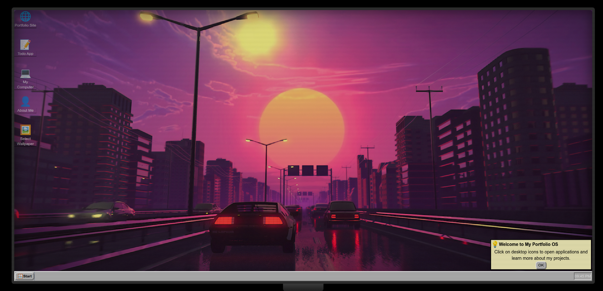

# Windows 95-Style Portfolio OS



## 👨‍💻 About

A nostalgic Windows 95-inspired portfolio website that showcases my work as a full-stack developer. The site functions like an old-school operating system with draggable windows, a start menu, desktop icons, and all the charming UI elements from the golden age of personal computing.

## 🚀 Features

- **Authentic Windows 95 UI** with pixel-perfect recreation of the classic interface
- **Interactive desktop environment** with draggable windows and icons
- **Working Start Menu** with program shortcuts
- **CRT monitor effect** for maximum retro vibes
- **Responsive design** that adapts to different screen sizes
- **Multiple "applications"** to showcase projects, skills, and resume
- **Customizable wallpaper** through the display properties
- **Classic Windows behaviors** like window maximizing, minimizing and focus management

## 🛠️ Technologies

- **React** with TypeScript for a robust component system
- **Vite** for lightning-fast builds and development
- **Tailwind CSS** for styling with custom retro theme extensions
- **React Icons** for Windows 95-style interface elements
- **Custom hooks** for window management and desktop behavior

## 🧩 Key Components

- **Window System**: Draggable, resizable windows with title bars, minimize/maximize/close buttons
- **Desktop**: Icon grid system with selection, dragging, and context menu
- **Taskbar**: Start menu, window management, and system tray with clock
- **Portfolio Content**: About me, projects, resume, and contact information
- **CRT Monitor Frame**: Simulated monitor bezels and screen effects for immersion

## 🔍 How It Works

The application simulates a desktop environment with a window management system. Windows can be opened, moved, minimized, maximized, and closed. Desktop icons can be dragged around and arranged on a grid. The Start Menu provides quick access to applications.

The content includes my skills, projects, and contact information, all presented through the nostalgic lens of Windows 95.

## 📱 Responsive Design

Despite being inspired by an operating system from the 1990s, the portfolio is fully responsive and works on tablets and phones. The monitor frame scales appropriately to provide the CRT experience across different devices.

## 🧠 Interesting Technical Details

- Custom z-index management for proper window stacking
- Grid-based icon positioning system with collision detection
- CRT screen effects using CSS for authentic retro feel
- PDF resume download functionality
- Smooth transitions and animations for window operations

## 🚀 Getting Started

```bash
# Clone the repository
git clone https://github.com/HugoNicolau/Portifolio-Retro.git

# Navigate to the project directory
cd Portifolio-Retro

# Install dependencies
npm install

# Start the development server
npm run dev

# Build for production
npm run build
```

## 📝 License

This project is available for use under the MIT License.

## 👤 About Me

Hi, I'm Hugo Nicolau! I'm a passionate full-stack developer with expertise in React, TypeScript, Node.js, and more. This portfolio showcases my love for nostalgic UI combined with modern web development practices.

Feel free to check out more of my work:
- 🔗 [LinkedIn](https://linkedin.com/in/hugo-nicolau)
- 🐙 [GitHub](https://github.com/HugoNicolau)
- 📧 [Email](mailto:nicolau.hugogiles@gmail.com)

---

*This portfolio is a tribute to the classic Windows 95 UI design. It's not affiliated with Microsoft in any way.*